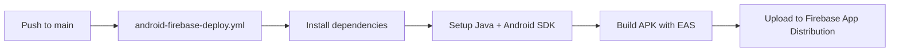
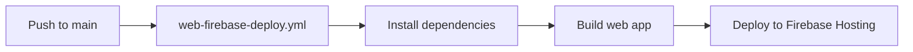

# ???? Focused Firebase Deployment Guide

Clean, focused GitHub Actions workflows for deploying your Android and web apps to Firebase.

## ???? Focused Workflows Created

### ???? **android-firebase-deploy.yml**
- **Purpose:** Build Android APK and deploy to Firebase App Distribution
- **Triggers:** Pushes to main/master that affect mobile code
- **Output:** APK available for testers in Firebase App Distribution

### ???? **web-firebase-deploy.yml**  
- **Purpose:** Build web app and deploy to Firebase Hosting
- **Triggers:** Pushes to main/master that affect web/mobile code
- **Output:** Web app available at `https://combo-624e1.web.app`

## ???? Deployment Flow

### Android Deployment


### Web Deployment


## ???? Required Secrets

| Secret | Android Workflow | Web Workflow | Description |
|--------|----------------|--------------|-------------|
| `FIREBASE_SERVICE_ACCOUNT` | ??? | ??? | Firebase authentication |
| `FIREBASE_APP_ID` | ??? | ??? | Android app identification |
| `FIREBASE_PROJECT_ID` | ??? | ??? | Firebase project ID |
| `EXPO_ACCESS_TOKEN` | ??? | ??? | EAS CLI authentication |

## ???? Setup Steps

### 1. Run Setup Script
```bash
./.github/workflows/setup-focused-secrets.sh
```

### 2. Configure GitHub Secrets
Add these secrets to your repository:
- `FIREBASE_SERVICE_ACCOUNT` - Full JSON service account key
- `FIREBASE_APP_ID` - Your Firebase Android app ID
- `FIREBASE_PROJECT_ID` - `combo-624e1`
- `EXPO_ACCESS_TOKEN` - Your Expo access token

### 3. Deploy
```bash
# Deploy Android APK
# Triggered automatically on mobile code changes

# Deploy web app  
# Triggered automatically on web/mobile code changes

# Manual trigger
# Go to GitHub Actions ??? Select workflow ??? "Run workflow"
```

## ???? Android Deployment Details

### What Gets Built
- ??? React Native Android APK
- ??? Built with EAS Build (preview profile)
- ??? Optimized for distribution

### Firebase App Distribution
- ??? APK uploaded to Firebase App Distribution
- ??? Available for testers group
- ??? Release notes with commit info
- ??? Download links shared automatically

### Access
- **Firebase Console:** App Distribution tab
- **Testers:** Receive email invitations
- **Download:** Direct APK download links

## ???? Web Deployment Details

### What Gets Built
- ??? React Native web build
- ??? Optimized for production
- ??? CDN distribution
- ??? SSL certificate

### Firebase Hosting
- ??? Deployed to `https://combo-624e1.web.app`
- ??? Global CDN distribution
- ??? Automatic SSL
- ??? Mobile-optimized

### Access
- **Production URL:** `https://combo-624e1.web.app`
- **Custom Domain:** Configure in Firebase Console (optional)

## ???? Trigger Conditions

### Android Workflow Triggers
- ??? Pushes to `main`/`master` branches
- ??? Changes to `mobile/**` files
- ??? Manual trigger available

### Web Workflow Triggers  
- ??? Pushes to `main`/`master` branches
- ??? Changes to `mobile/**`, `web/**`, `frontend/**` files
- ??? Manual trigger available

## ???? Troubleshooting

### Check Workflow Status
1. Go to GitHub repository
2. Click "Actions" tab
3. Select running/failed workflow
4. View logs for detailed errors

### Common Issues

**Authentication Failed**
```bash
# Check if secrets are properly set
# Verify FIREBASE_SERVICE_ACCOUNT JSON format
# Ensure EXPO_ACCESS_TOKEN is valid
```

**Build Failed**
```bash
# Check EAS CLI version compatibility
# Verify Android SDK setup
# Check Java 17 installation
```

**Deployment Failed**
```bash
# Verify Firebase project permissions
# Check Firebase App Distribution groups
# Ensure hosting is enabled
```

## ???? Monitoring

### GitHub Actions
- **Status:** Real-time workflow monitoring
- **Logs:** Detailed build and deployment logs
- **Artifacts:** Download built APKs

### Firebase Console
- **Hosting:** Deployment status and metrics
- **App Distribution:** Tester access and downloads
- **Functions:** API performance (if using)

## ???? Benefits of Focused Approach

- ??? **Faster builds** - Only build what's needed
- ??? **Better reliability** - Simpler workflows
- ??? **Easier debugging** - Clear separation of concerns
- ??? **Resource efficient** - No unnecessary operations
- ??? **Flexible triggers** - Different conditions per workflow

---

**???? Your focused Firebase deployment is ready! Set up the secrets and push to deploy.**
